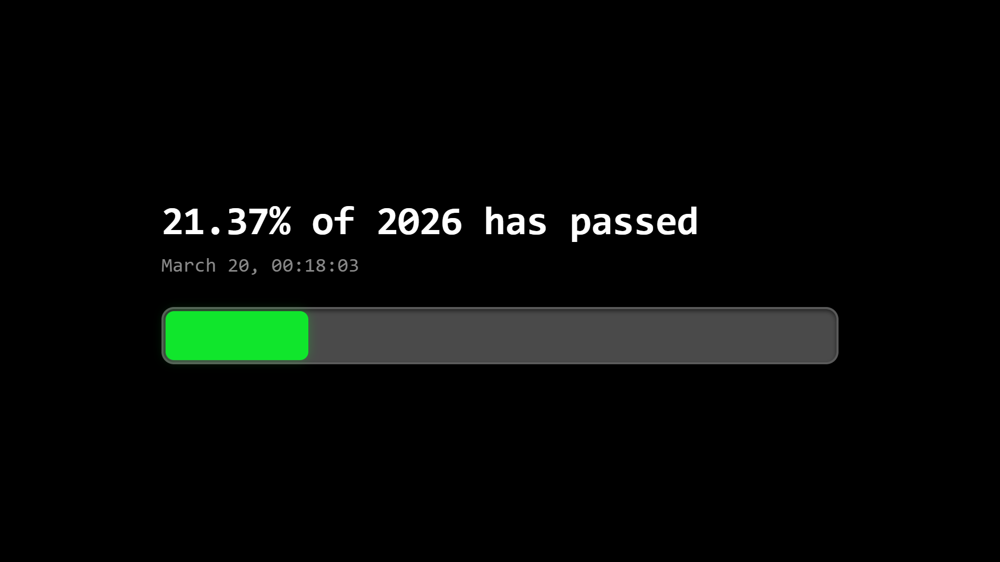

# Year Progress Tracker

A beautifully designed, highly responsive, real-time year progress tracking web application. Watch the days and percentage of the current year pass by with smooth updates and 8 distinctive UI themes.

## 🚀 Features

- **Offline-friendly**
  Core layout and logic live in local files (`index.html`, `styles.css`, `script.js`). CDNs are used for fonts, screenshot export (`dom-to-image-more`), and copy toasts (`toastify-js`).

- **Real-Time Tracking**
  Calculates the exact percentage of the year elapsed, up to 2 decimal places, with seamless updates.

- **8 Unique Themes**
  - **Default**: Sleek, dark terminal-style interface
  - **Shadcn**: Minimal, modern enterprise aesthetic
  - **GitHub**: Full 365-day grid simulating a contribution graph, mapped accurately by weekday
  - **Windows 7 Aero**: Recreation of the classic file copy dialog with translucent glass effects and glowing progress bars
  - **Cyberpunk**: Dark sci-fi HUD with animated scanlines
  - **Claymorphism**: Premium 3D dark-mint neumorphism style
  - **Windows 95**: Retro classic UI
  - **Brutalism**: Bold, high-contrast, blocky layout

- **Theme Persistence**
  Uses `localStorage` to remember your selected theme for future visits.

- **HD Image Export**
  Built-in screenshot support via `dom-to-image-more`, allowing high-resolution image downloads of your current progress.

- **Fully Responsive**
  Optimized for desktops, tablets, and mobile devices.

## 🛠️ Technology Stack

- **HTML5**
  Markup in `index.html`

- **CSS3 (Vanilla)**
  All styling in `styles.css`: flexbox, grid, keyframe animations, and theme layouts

- **JavaScript (Vanilla ES6)**
  Logic in `script.js`: date/time, themes, GitHub grid, export, URL helpers

- **External libraries**
  `dom-to-image-more` (screenshots), Toastify (copy feedback), Google Fonts

## 💻 How to Use

1. Open [index.html](https://nahian.pro.bd/year) in a modern browser (keep `styles.css` and `script.js` next to it if you run it locally).
2. Double-click anywhere on the page, or use the 🎨 button to cycle themes.
3. Use 📥 to save a high-resolution screenshot.
4. Use 🔗 to copy a share URL that includes `hide_config` and the current `theme`.

### URL query parameters

- **`theme`** — Open a specific theme by slug (e.g. `github`, `win7`) or full token (e.g. `theme-github`).
- **`hide_config`** — Hides the bottom control bar (embed-friendly). Double-click theme switching is disabled in this mode.

## 📁 Project files

| File | Role |
|------|------|
| `index.html` | Page structure, CDN links |
| `styles.css` | All theme and layout CSS |
| `script.js` | App behavior |
| `preview.png` | Readme preview image |

## 👤 Author

- **Name**: Al Nahian
- **Website**: https://nahian.pro.bd
- **GitHub**: https://github.com/alnahian2003

---

Handcrafted with HTML, CSS, and JavaScript. No heavy frameworks involved.